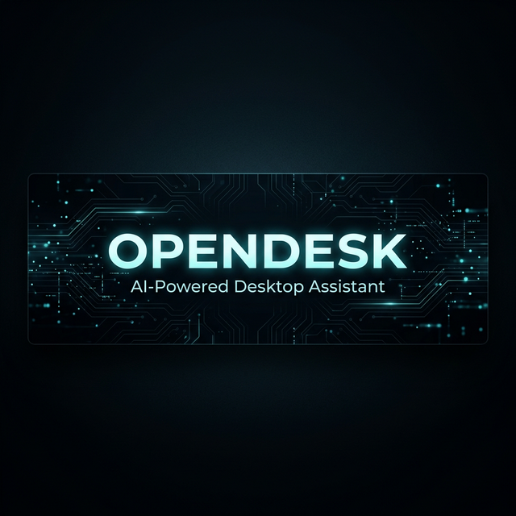

<p align="center">
  
</p>

<h1 align="center">OpenDesk AI</h1>

<p align="center">
  <b>Your AI-powered desktop assistant that lives inside Telegram.</b><br>
  Control your entire computer — files, apps, browser, terminal, and more — from anywhere via chat.
</p>

<p align="center">
  <a href="https://github.com/Akshat-Commit/OpenDeskAI/stargazers">
    
  </a>
  <a href="https://github.com/Akshat-Commit/OpenDeskAI/blob/main/LICENSE">
    
  </a>
  <a href="https://github.com/Akshat-Commit/OpenDeskAI/issues">
    
  </a>
  <a href="https://www.python.org/">
    
  </a>
</p>

<p align="center">
  <a href="#-features">Features</a> •
  <a href="#-requirements">Requirements</a> •
  <a href="#-installation">Installation</a> •
  <a href="#-how-to-run">How to Run</a> •
  <a href="#-tech-stack">Tech Stack</a> •
  <a href="#-contributing">Contributing</a>
</p>

---

## ✨ Features

| Category | Capabilities |
|----------|-------------|
| 🖥️ **System Control** | Volume, brightness, screenshots, lock, shutdown, restart, clipboard |
| 📁 **File Management** | Create, read, move, delete, search files and folders |
| 🌐 **Browser Automation** | Open URLs, search Google, interact with web pages via Selenium |
| ⌨️ **Terminal Access** | Run PowerShell commands, execute scripts, install packages |
| 📄 **Document Intelligence** | Read PDFs, Word docs, Excel sheets, PowerPoint presentations |
| 🚀 **App Launcher** | Open any application by name with smart detection |
| 🐍 **Python Execution** | Run Python code snippets directly from chat |
| 👁️ **Vision AI** | Describe what's on screen using Moondream vision model |
| 🔄 **Multi-LLM Fallback** | Automatically switches between Ollama → Groq → Gemini |
| 🌍 **Remote Access** | Cloudflare tunnel + QR code — control your PC from anywhere |
| 🛡️ **Secure** | Telegram ID whitelist — only you can access your machine |

---

## 📋 Requirements

- **Python** 3.10 or higher
- **Ollama** installed and running ([Download Ollama](https://ollama.ai))
- **Telegram Bot Token** (see [setup guide](#-getting-your-telegram-bot-token) below)
- **Windows 10/11** (primary support)
- **4GB+ RAM** recommended (8GB+ for local vision model)

---

## 🛡️ Security & Access Control

OpenDesk is designed with security in mind to ensure only you can control your machine:

1.  **ID Whitelist**: The bot will *only* respond to the Telegram user ID specified in your `.env` file (`ALLOWED_TELEGRAM_ID`).
2.  **No Hardcoded Keys**: All API keys and tokens are stored in `.env`, which is automatically ignored by Git.
3.  **QR Authentication**: Each session requires a unique, short-lived QR code/token to link your laptop to your Telegram account.

### How to find your Telegram ID?
Search for **@userinfobot** on Telegram and send a message. It will reply with your unique multi-digit ID. Paste this into your `.env` file:
```bash
ALLOWED_TELEGRAM_ID=123456789
```

---

## 🔑 Getting Your Telegram Bot Token

1. Open Telegram and search for **@BotFather**
2. Send `/newbot` and follow the prompts
3. Choose a **name** (e.g., `My OpenDesk Bot`)
4. Choose a **username** ending in `bot` (e.g., `my_opendesk_bot`)
5. BotFather will give you a **token** like: `7123456789:AAH...`
6. Copy this token — you'll need it during setup

> **Tip:** Also send `/mybots` → select your bot → **Bot Settings** → **Allow Groups** → Turn OFF (for security).

---

## 🚀 Installation

```bash
# 1. Clone the repository
git clone https://github.com/Akshat-Commit/OpenDeskAI.git
cd OpenDeskAI

# 2. Create a virtual environment
python -m venv .venv

# 3. Activate it
# Windows PowerShell:
.\.venv\Scripts\Activate.ps1
# Windows CMD:
.venv\Scripts\activate.bat

# 4. Install dependencies
pip install -r requirements.txt

# 5. Copy the example environment file
copy .env.example .env

# 6. Edit .env and add your credentials
# Required: BOT_TOKEN, BOT_USERNAME
# Optional: GROQ_API_KEY, GEMINI_API_KEY
```

---

## ▶️ How to Run

```powershell
# Run the setup wizard (first time only)
.\run.ps1 config

# Check system health
.\run.ps1 status

# Start the bot
.\run.ps1 start
```

On first run, OpenDesk will:
1. Auto-detect your hardware and select the best AI model
2. Start Ollama if it's not running
3. Run health checks on all systems
4. Create a Cloudflare tunnel for remote access
5. Generate a QR code — scan it with Telegram to connect

---

## 🏗️ Tech Stack

| Layer | Technology |
|-------|-----------|
| **AI Engine** | LangChain + Ollama + Groq + Google Gemini |
| **Vision** | Moondream (local vision model) |
| **Bot Interface** | python-telegram-bot |
| **Tunneling** | Cloudflare (pycloudflared) |
| **Database** | SQLite3 |
| **Logging** | Loguru |
| **UI** | Rich + Pyfiglet (terminal aesthetics) |
| **Automation** | PyAutoGUI, Selenium, PyWin32 |
| **Document Parsing** | PyPDF2, python-docx, pandas, openpyxl |

---

## 📁 Project Structure

```
OpenDeskAI/
├── opendesk/
│   ├── main.py              # Entry point & CLI
│   ├── bot.py               # Telegram bot handler
│   ├── config.py            # Environment configuration
│   ├── health_check.py      # System status checks
│   ├── setup_wizard.py      # First-run setup
│   ├── agent.py             # LangChain agent core
│   ├── ollama_agent/        # LLM provider integration
│   ├── tools/               # All tool implementations
│   │   ├── system.py        # Volume, brightness, etc.
│   │   ├── filesystem.py    # File operations
│   │   ├── browser.py       # Web automation
│   │   ├── terminal.py      # Shell commands
│   │   ├── app_launcher.py  # Application launcher
│   │   ├── office.py        # Office file tools
│   │   ├── document_reader.py # Document parsing
│   │   └── python_execution.py
│   ├── db/                  # SQLite database layer
│   └── utils/               # Banner, QR, monitors
├── tests/                   # Test suite
├── .env.example             # Environment template
├── requirements.txt
├── run.ps1                  # PowerShell launcher
└── README.md
```

---

## 🤝 Contributing

Contributions are welcome! Here's how to get started:

1. **Fork** the repository
2. **Create** your feature branch
   ```bash
   git checkout -b feature/amazing-feature
   ```
3. **Commit** your changes
   ```bash
   git commit -m "feat: add amazing feature"
   ```
4. **Push** to the branch
   ```bash
   git push origin feature/amazing-feature
   ```
5. **Open** a Pull Request

### Guidelines
- Follow existing code style and patterns
- Write tests for new features
- Keep commits atomic and well-described
- Update documentation as needed

---

## 📄 License

This project is licensed under the **MIT License** — see the [LICENSE](LICENSE) file for details.

---

<p align="center">
  <b>If you find OpenDesk useful, please consider giving it a ⭐</b><br>
  It helps others discover the project!
</p>

<p align="center">
  <a href="https://github.com/Akshat-Commit/OpenDeskAI/stargazers">
    
  </a>
</p>

<p align="center">
  Made with ❤️ by <a href="https://github.com/Akshat-Commit">Akshat Jain</a>
</p>
