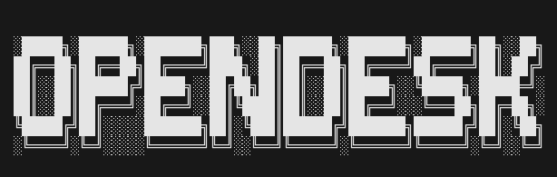

<p align="center">
  
</p>

<h1 align="center">
  OpenDesk-AI
</h1>

<p align="center">
  <b>Control your entire computer 
  from Telegram — powered by local AI.</b>
  <br>
  Free. Private. No subscription needed.
</p>

<p align="center">
  <a href="https://github.com/Akshat-Commit/OpenDeskAI/stargazers">
    
  </a>
  <a href="https://github.com/Akshat-Commit/OpenDeskAI/blob/main/LICENSE">
    
  </a>
  <a href="https://github.com/Akshat-Commit/OpenDeskAI/issues">
    
  </a>
  <a href="https://www.python.org/">
    
  </a>
</p>

<p align="center">
  <a href="#-what-is-opendesk">What is OpenDesk</a> •
  <a href="#-features">Features</a> •
  <a href="#-requirements">Requirements</a> •
  <a href="#-installation">Installation</a> •
  <a href="#-usage">Usage</a> •
  <a href="#-tech-stack">Tech Stack</a> •
  <a href="#-contributing">Contributing</a>
</p>

---

## 🤔 What is OpenDesk?

OpenDesk is a free, open-source AI 
agent that lets you control your 
Windows laptop remotely through 
Telegram using local AI models.

Think of it as a free alternative 
to Claude Remote Control — but 
everything runs on YOUR machine.
No cloud. No subscription. 
No privacy concerns.

You → Telegram → OpenDesk → Your Laptop

---

## ✨ Features

| Category | What You Can Do |
|----------|----------------|
| 🖥️ System Control | Volume, brightness, screenshots, lock, shutdown |
| 📁 File Management | Create, read, move, delete, search files |
| 🌐 Browser Control | Open URLs, search Google, web automation |
| ⌨️ Terminal Access | Run PowerShell commands and scripts |
| 📄 Document Tools | Read PDFs, Word docs, Excel, PowerPoint |
| 🚀 App Launcher | Open any app by name instantly |
| 🐍 Code Execution | Run Python snippets from chat |
| 👁️ Vision AI | See and describe your screen (optional) |
| 🔄 Smart Fallback | Auto switches between AI models |
| 🌍 Remote Access | Control from anywhere via QR code |
| 🛡️ Private & Secure | Only YOU can access your machine |
| ⚡ Fast-Lane Architecture | Instant Semantic Routing with 0-delay RAM Caching |
| 👻 Background Daemon | Run 24/7 silently via PM2 Process Manager |
| ⌨️ Typer CLI | Fully featured terminal interface (`opendesk start`, `logs`, `config`) |

---

## 📋 Requirements

### Must Have:
- Windows 10 or Windows 11
- Python 3.10 or higher
- Ollama installed ([Download here](https://ollama.ai))
- Telegram account
- Internet connection (for Telegram)

### Minimum Hardware:
| RAM | Recommended Model | Experience |
|-----|-------------------|------------|
| 8GB | gemma3:4b | Good |
| 12GB | gemma3:12b | Better |
| 16GB+ | gemma3:12b | Best |

### Optional (For Faster AI):
- Free Groq API key ([Get here](https://console.groq.com))
- Free Gemini API key ([Get here](https://aistudio.google.com))

### Optional (For Screen OCR):
- Tesseract OCR for text extraction ([Download here](https://github.com/UB-Mannheim/tesseract/wiki))

> ⚠️ Note: OpenDesk currently 
> supports Windows only. 
> Linux/Mac support coming soon.

---

## 🔑 Step 1 — Get Telegram Bot Token

1. Open Telegram
2. Search **@BotFather**
3. Send `/newbot`
4. Choose a name: `My OpenDesk`
5. Choose username: `my_opendesk_bot`
6. Copy the token you receive

> 💡 Tip: Go to Bot Settings →
> Allow Groups → Turn OFF
> for better security.

---

## 🔑 Step 2 — Find Your Telegram ID

1. Open Telegram
2. Search **@userinfobot**
3. Send any message
4. Copy the ID it shows you

---

## 🚀 Installation
```bash
# Clone the repository
git clone https://github.com/Akshat-Commit/OpenDeskAI.git
cd OpenDeskAI

# Create virtual environment
python -m venv .venv

# Activate (Windows PowerShell)
.\.venv\Scripts\Activate.ps1

# Install dependencies
pip install -r requirements.txt

# Copy environment template
copy .env.example .env
```

Now open `.env` and fill in:
BOT_TOKEN=your_token_here
BOT_USERNAME=your_bot_username
ALLOWED_TELEGRAM_ID=your_telegram_id
OLLAMA_MODEL_NAME=gemma3:12b

---

## ▶️ Usage
OpenDesk is controlled entirely through its new Typer CLI interface.

```powershell
# First time interactive setup
opendesk config

# Check if all systems are healthy
opendesk status

# Start OpenDesk
opendesk start
```

### 💻 All CLI Commands
| Command | Description | Options |
|---------|-------------|---------|
| `opendesk start` | Start the agent & display QR code | `--mode local/cloud`, `--debug` |
| `opendesk stop` | Gracefully kill the running agent | None |
| `opendesk config` | Interactive setup wizard | `--reset` |
| `opendesk logs` | View terminal logs | `--follow`, `--errors`, `--lines 50` |
| `opendesk status` | Show health checks | None |
| `opendesk version` | Display tool versions | None |
| `opendesk update` | Update from git (pip upgrade) | None |

When started:
1. Banner appears in terminal
2. Health checks run automatically
3. Cloudflare tunnel starts
4. QR code appears in terminal
5. Scan QR with your phone camera
6. Telegram bot opens automatically
7. Start sending commands!

### Example Commands:
"open chrome"
"set volume to 50"
"take a screenshot"
"list my desktop files"
"search youtube for lofi music"
"what is my battery level"
"play Blinding Lights on Spotify"
"create a file called notes.txt"

---

## 👻 Running in the Background (24/7)
If you don't want to keep a terminal window open, you can run OpenDesk silently as a background service using **PM2**.

1. Install PM2: `npm install -g pm2`
2. Start the daemon: `pm2 start ecosystem.config.js`
3. Save the process: `pm2 save`

**PM2 Cheatsheet:**
- View live logs: `pm2 logs OpenDesk`
- View status: `pm2 status`
- Stop the bot: `pm2 stop OpenDesk`
- Restart the bot: `pm2 restart OpenDesk`

---

## 🏗️ Tech Stack

| Layer | Technology |
|-------|-----------|
| AI Engine | LangChain + Ollama |
| Cloud AI | Groq + Google Gemini (optional) |
| Vision | Moondream (optional) |
| Bot Interface | python-telegram-bot |
| Tunneling | Cloudflare (pycloudflared) |
| Database | SQLite3 |
| Logging | Loguru |
| Terminal UI | Rich + Pyfiglet |
| Automation | PyAutoGUI + Selenium |
| Documents | PyPDF2 + python-docx + pandas |

---

## 📁 Project Structure
```text
OpenDeskAI/
├── opendesk/
│   ├── main.py           # Entry point
│   ├── bot.py            # Telegram handler
│   ├── config.py         # Configuration
│   ├── health_check.py   # System checks
│   ├── setup_wizard.py   # First run setup
│   ├── agent.py          # AI agent core
│   ├── ollama_agent/     # LLM integration
│   ├── tools/            # All tools
│   │   ├── system.py
│   │   ├── filesystem.py
│   │   ├── browser.py
│   │   ├── terminal.py
│   │   └── app_launcher.py
│   ├── db/               # Database layer
│   └── utils/            # Banner, QR code
├── tests/                # Test suite
├── .env.example          # Config template
├── requirements.txt      # Dependencies
├── run.ps1               # Windows launcher
└── README.md
```

---

## 🛡️ Security

- Only your Telegram ID can send commands
- All API keys stored in .env (never in code)
- .env is git ignored (never uploaded)
- Session QR expires after each use
- All AI runs locally on your machine

---

## ❓ FAQ

**Q: Does it work without internet?**
A: Partially. Telegram needs internet. 
   But AI runs locally via Ollama.

**Q: Is it free?**
A: 100% free and open source forever.

**Q: Does my data go to the cloud?**
A: No. Everything runs on your laptop.
   Only Telegram messages use internet.

**Q: Which AI model should I use?**
A: gemma3:12b if you have 16GB RAM.
   gemma3:4b if you have 8GB RAM.

**Q: Does it work on Mac or Linux?**
A: Windows only for now. 
   Mac/Linux support coming soon.

**Q: Can others access my laptop?**
A: No. Only your Telegram ID works.
   Others get ignored completely.

---

## 🤝 Contributing

Contributions are welcome!

1. Fork the repository
2. Create your branch:
```bash
   git checkout -b feature/your-feature
```
3. Commit your changes:
```bash
   git commit -m "feat: add your feature"
```
4. Push and open a Pull Request

### Guidelines:
- Keep code clean and documented
- Follow existing code style
- Describe your changes clearly

---

## 📄 License

MIT License — free to use, modify 
and distribute.

See [LICENSE](LICENSE) for details.

---

<p align="center">
  <b>Found OpenDesk useful? 
  Give it a ⭐ on GitHub!</b>
</p>

<p align="center">
  Made with ❤️ by 
  <a href="https://github.com/Akshat-Commit">
    Akshat Jain
  </a>
</p>
